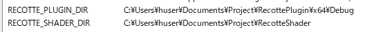

# RecottePlugin

RecotteStudioのプラグインです。


## 対応バージョン

- RecotteStudio v1.3.7.6

## インストール方法

1. RecotteStudioをインストール

1. [こちら](https://github.com/wallstudio/RecottePlugin/releases/)から最新版をダウンロードして適当なところに展開してください。

1. `RecottePlugin`フォルダをUserフォルダの中に配置します。

1. `RecottePlugin\install.bat`をダブルクリックで実行し、RecotteStudioのインストールフォルダに`d3d11.dll`がインストールされます。

1. レコスタを起動すると、`RecottePlugin`フォルダ内のプラグインが読み込まれます。

```
C:\Users\<ユーザー名>
    └ RecottePlugin
        ├ README.md
        ├ install.bat
        └ …
```

## 機能

#### RecottePluginFoundation

PluginをロードするためのPluginです。

`RecottePluginFoundation.dll`は`install.bat`によって`d3d11.dll`としてRecotteStudioのインストールフォルダにインストールされます。
シンボリックリンクの形としてインストールされるので元のファイルも削除しないでください。

これは`C:\Windows\System32\d3d11.dll`のProxyDLLとして動作します。

#### LayerFolding

レイヤーの折り畳み機能を追加します。

レイヤーのラベル（左側のペイン）の左上にある■をクリックするとそのレイヤーの折り畳み状態をON/OFFできます。反映は、次の再描画のタイミング（タイムラインをクリックしたときなど）からとなっています。

話者レイヤーと注釈レイヤーが対応しています。注釈レイヤーは画像を重ねがちなので活用しやすいかも。
レイヤー内のオブジェクトのクリッピングはされていないので、下のレイヤーの背面に透けて見えていますがこれは仕様です。

#### CustomSkin

タイムラインの背景に画像を描画する機能です。

`RecottePlugin`フォルダ内に`skin.png`の名前で画像を入れておくことでタイムラインに召喚することができます。  

デフォルトで私服のマキさんが描かれるようになっています。かわいいね！

#### RecotteShaderLoader

[RecotteShader](https://github.com/wallstudio/RecotteShader)を読み込む機能です。
詳細はRecotteShader側のドキュメントを参照してください。

## ビルド環境

- VisualStudio2019 16.10.2

`std::format`とか使ってるので少し前のバージョンでも動かないと思います。

通常、`RecottePluginFoundation.dll`は`~\RecottePlugin`以下のPluginをロードしますが、環境変数`RECOTTE_PLUGIN_DIR`にディレクトリを設定しておくことで別ディレクトリからロードさせることもできます。



## 新しいPluginの開発方法

このリポジトリをフォークして拡張するのではなく、別のプロジェクトとして「`~/RecottePlugin`以下にコピーしてインストールしてね」というスタイルを取っていただけると助かります。

`LayerFolding.cpp`あたりを参考にして、`OnPluginStart`と`OnPluginFinish`をエクスポートしたDLLを作ってください。

結局のところRecotteStudio内部の処理をもりもり書き換えないことには何もできないので覚悟が必要です。一応動的に書き換えるためのUtilityが`HookHelper`で実装されているので必要に応じて使ってください。

## メモ

作りとしてはWin32のWindowシステムベースだけど、GDI+で独自の描画をしている個所が多いのでUIいじる系は結構大変？

- https://qiita.com/up-hash/items/28375739208402721323
- https://qiita.com/up-hash/items/8ca41c4038c26a96674a
- https://gist.github.com/wallstudio/b78ce70e015058f7c33e391b0cfd7815
- https://silight.hatenablog.jp/entry/2016/08/23/212820
