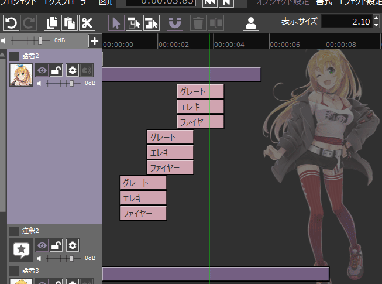

# RecottePlugin

RecotteStudioのプラグインです。

## 対応バージョン

- =v1.3.7.1
- =v1.3.7.2

## 使い方

1. RecotteStudioをインストール

1. [こちら](https://github.com/wallstudio/RecottePlugin/releases/)から最新版をダウンロードして適当なところに展開

1. RecotteStudioのあるフォルダに中身をコピー（`RecotteStudio.exe`と`Plugins`フォルダが同じ階層になるように）

1. レコスタを起動すると、Pluginsの中のプラグインが読み込まれます。

## 機能

* Pluginのロード（`d3d11.dll`）

* レイヤーの折り畳み機能（`LayerFolding.dll`）

* タイムラインにマキマキを描画（`CustomSkin.dll`）

## ビルド環境

- VisualStudio2019 16.10.2

`std::format`とか使ってるので少し前のバージョンでも動かないと思います。

`link.bat`を実行して開発用ディレクトリとRecotteStudioのインストールディレクトリにリンクを貼ってください。VisualStudioでのビルドの際には開発用ディレクトリにのみコピーされるようになっています。（UACがうざいので）

## 開発方法

`LayerFolding.cpp`あたりを参考にして、`OnPluginStart`と`OnPluginFinish`をエクスポートしたdllを作ってください。

結局のところRecotteStudio内部の処理をもりもり書き換えないことには何もできないので覚悟が必要です。一応動的に書き換えるためのUtilityが`HookHelper`で実装されているので必要に応じて使ってください。

## メモ

作りとしてはWin32のWindowシステムベースだけど、GDI+で独自の描画をしている個所が多いのでUIいじる系は結構大変？

